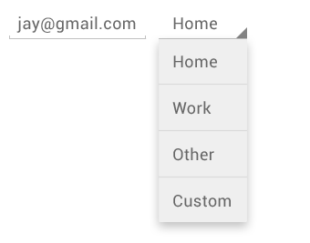

description: Spinner

# Spinner

Spinners provide a quick way to select one value from a set. In the default state, a spinner shows its currently selected value. Touching the spinner displays a dropdown menu with all other available values, from which the user can select a new one.



```xml
<Spinner
    android:id="@+id/sort_by_spinner"
    android:layout_width="match_parent"
    android:layout_height="wrap_content" />
```

### Populate Spinner with choices with XML
You can populate the Spinner using a `string-array` resource. Create a file the `Resources\Values` folder and call it `array.xml`

```xml
<?xml version="1.0" encoding="utf-8"?>
<resources>
    <string-array name="cities">
        <item>Home</item>
        <item>Work</item>
        <item>Other</item>
        <item>Custom</item>
    </string-array>
</resources>
```


Now you can populate the entries for the spinner using the data from the xml file.

```xml
<Spinner
    android:entries="@array/cities"
    android:layout_width="wrap_content"
    android:layout_height="wrap_content"/>
```

### Spinner Mode
The spinner by default displays a dropdown, but it can be changed to show a dialog using the `android:spinnerMode="dialog"`.


### Populate Spinner with code

To populate the spinner in code, you will need to create a custom array adapter, then bind the array adapter to the spinner or create it using an existing xml file with a string array.

```java
Spinner spinner = (Spinner) findViewById(R.id.spinner);
// Create an ArrayAdapter using the string array and a default spinner layout
ArrayAdapter<CharSequence> adapter = ArrayAdapter.createFromResource(this,
        R.array.planets_array, android.R.layout.simple_spinner_dropdown_item);
// Specify the layout to use when the list of choices appears
adapter.setDropDownViewResource(android.R.layout.simple_spinner_custom_layout);
// Apply the adapter to the spinner
spinner.setAdapter(adapter);
```


### Getting and Setting Values

Get the selected item out a spinner using:

```java
String value = spinner.getSelectedItem().toString();
```

Setting spinner item based on value (rather than item position):

```java
public void setSpinnerToValue(Spinner spinner, String value) {
	int index = 0;
	SpinnerAdapter adapter = spinner.getAdapter();
	for (int i = 0; i < adapter.getCount(); i++) {
		if (adapter.getItem(i).equals(value)) {
			index = i;
			break; // terminate loop
		}
	}
	spinner.setSelection(index);
}
```

### Customizing Spinner Items

Changing text size on the `<Spinner>` tag has no effect on the actual dropdown items. To change their styles, you need to create a custom array adapter and layout file. First, you should create a `spinner_item1.xml`

```xml
<TextView xmlns:android="http://schemas.android.com/apk/res/android"
    android:id="@android:id/text1"
    android:layout_width="match_parent"
    android:layout_height="wrap_content"
    style:"@style/spinner_dropdown_style1"
    android:textColor="#ff0000" />
```

Define your style to inherit from `Widget.AppCompat.DropDownItem.Spinner` so that it will inherit the correct spacing for dropdown items. Otherwise, you may notice the dropdown items are too closely spaced or not enough margin to the left-hand side:

```xml
<style name="spinner_dropdown_style_theme1" parent="Widget.AppCompat.DropDownItem.Spinner">
     <item name="android:textColor">@android:color/white</item>
     <item name="android:background">#507B91</item>
</style>
```

You then bind the string array of items to the layout:

```java
ArrayAdapter adapter = ArrayAdapter.createFromResource(this, R.array.planets_array, R.layout.spinner_item);
spinner.setAdapter(adapter);
```
